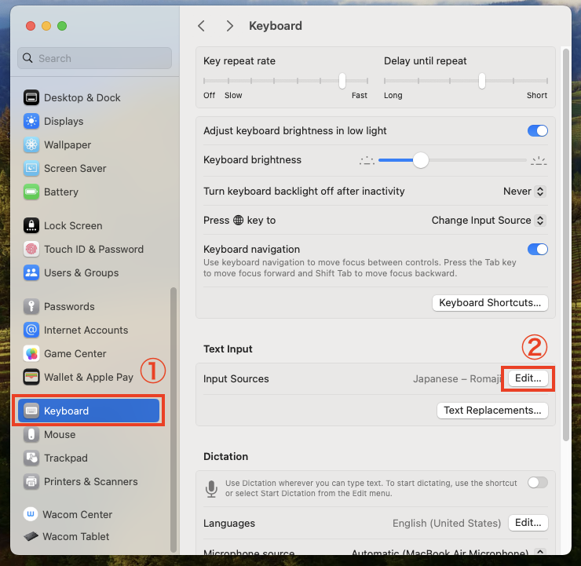

# macos-singlish-keyboard-layout
Apple Mac OS සඳහා සිංග්ලිෂ් සිංහල යතුරු පුවරුව

# Character Map

+ **Opt** → Option Key
+ **Shipt** → Shipt Key 

# සිංග්ලිෂ් යතුරු පුවරුව පිහිටුවා හැනීමේ පියවර
 
+ package ෆෝල්ඩර් එකේ අති mjay-singlish.dmg ෆයිල් එක මෙම [යොමුවෙන්](https://github.com/mJayTechLab/macos-singlish-keyboard-layout/raw/main/package/mjay-singlish.dmg) බාගත කර ගන්න. 

  ( යොමුව click කිරීමෙන් බාගත නොවේ නම් right click කර **save as** යන්න තෝරන්න )

+ බාගත වූ *mjay-singlish.dmg* ෆයිල් එක double click කරන්න.

+ ඉහත අකරයේ windows එකක් ඔබට දැකගත හැකි වේවි. එම window එකේ ඇති *Keyboard Installer* double click කරන්න.

+ ඉහත ආකරයේ window එකක් දිස්වනු ඇත.

+ විවෘත වූ window එකේ ඇති *install for current user* වෙත *mjay-singlish.bundle* ෆයිල් එක Drag & Drop කරන්න. Drag & Drop කිරීමෙන් පසු install කිරිමට *install for current user* icon එක click කරන්න. නිවැරදිව install වූවේනම් window එක ස්ව්‍යංක්‍රීයවම close වනු ඇත.

+ ඔබගේ account එක logout කර නැවත login වන්න. 

+ දැන් System Settings වෙත යන්න. 

+ ① Keyboard click කර Input Source හි ② Edit click කරන්න. 

+ ①[+] මාර්ක් එක click කරන්න. 

+ ① Sinhala භාශාව තෝරා ② mjay-singlish-en තෝරන්න. *( ඔබ Japanese කීබෝඩ් Layout එකක් සහිත කීබෝඩ් එකක් භාවිතා කරයි නම් mjay-singlish-jp තෝරන්න )* 

+ දැන් ඔබට සිංග්ලිෂ් සිංහල යතුරු පුවරුව install වි ඇති බව දිස්වනු ඇත. Done click කර System Settings වෙතින් ඉවත්වන්න. 

+ සිංග්ලිෂ් සිංහල යතුරු පුවරුව භාවිතා කිරීමට අවශ්‍ය විට පහත ආකරයට Keybord එක Select කරන්න. 

+ දැන් ඔබට ඕනෑම තැනක සිංග්ලිෂ් වලින් යතුරු කරනය කිරිමට හැකිය. 

# Bug Report
Keyboard එකේ යම් දෝශයක් ඇත්නම් Issues වෙතින් Report කරන්න.
